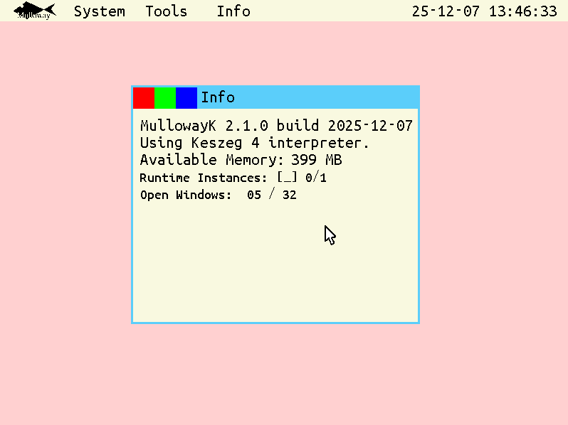
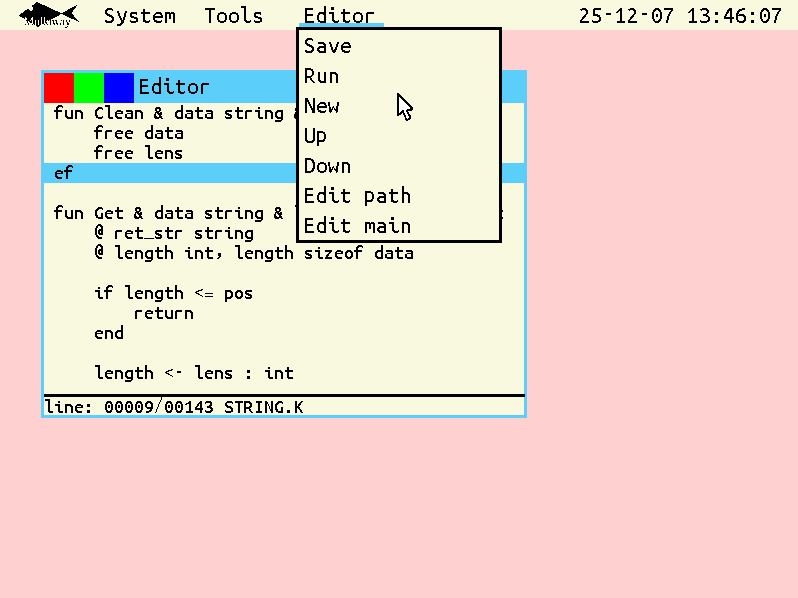
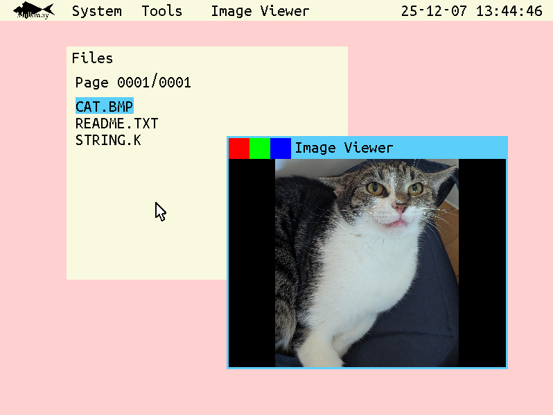

# MullowayK Operating System

MullowayK is a hobby x86 operating system written from scratch in C. It features a custom desktop environment with built-in tools and includes an interpreter for the Keszeg 4 programming language.

## Screenshots


*System Information window*


*Built-in text editor with Keszeg 4 code*


*BMP image viewer displaying a 24-bit color image*

## Features

### System Architecture
- **32-bit x86 Operating System** - Boots via GRUB multiboot
- **Dynamic Memory Management** - Interpreter instances allocated on-demand based on available RAM
- **Custom Kernel** - Written from scratch with minimal dependencies
- **Hardware Abstraction** - Direct hardware access and control

### Storage Support
- **IDE/ATA Drive Support** - Legacy IDE mode compatibility
- **SATA Drive Support** - Works with SATA drives in legacy IDE mode
- **PCI Bus Scanning** - Automatic detection of storage controllers
- **FAT32 File System** - Modified FAT32 implementation with fixed 16MB file size
  - Files are always allocated as 16MB (fixed size for compatibility)
  - No directory support (flat root directory only)
  - Dual FAT tables for redundancy
  - Optimized with FAT cache for improved performance

### Hardware Features
- **Graphics Support** - Custom VGA graphics driver with framebuffer
- **Keyboard Input** - PS/2 keyboard driver with interrupt handling
- **Mouse Support** - PS/2 mouse driver for desktop interaction
- **Serial Port Communication** - COM1 serial port for I/O operations
- **Real-Time Clock** - System timing and date/time functionality
- **SSE Support** - SSE for enhanced performance

### Programming Environment
- **Keszeg 4 Language Interpreter** - Built-in interpreter for the Keszeg 4 custom programming language
- **Dynamic Interpreter Instances** - Supports multiple concurrent runtime sessions with automatic memory allocation
- **Session Management** - Each runtime window gets its own isolated interpreter session (main + subordinate)

### Desktop Environment
- **Custom GUI** - Built-in desktop environment with simple window management
- **Built-in tools**:
  - **Text Editor** - Text and code editor mainly for the Keszeg code
  - **File Manager** - Browse and manage files on the storage device
  - **Runtime Environment** - Execute Keszeg 4 programs interactively with dynamic session creation
  - **Image Viewer** - View BMP images (24-bit uncompressed, up to 5.3M pixels)
  - **System Information** - Display system details, memory usage, and available runtime instances
  - **Debug Tools** - Buffer for system wide debug messages

### Memory Management
- **Dynamic Runtime Allocation** - Interpreter sessions allocated on-demand from high memory region
- **Automatic Memory Checks** - System validates available memory before creating new runtime sessions
- **Stack-based Function Calls** - Proper call stack management within interpreter
- **Variable Scoping** - Local and reference parameter support
- **Garbage Collection** - Automatic memory cleanup for interpreter variables
- **Session Lifecycle** - Memory freed when runtime windows are closed

## Building and Running

### Prerequisites

**Required packages (Debian/Ubuntu):**
```bash
sudo apt install gcc-x86-64-linux-gnu binutils-x86-64-linux-gnu make grub-pc-bin grub-common qemu-system-x86 dosfstools
```

**Required packages (Arch Linux):**
```bash
sudo pacman -S gcc make grub qemu-system-x86 dosfstools
```

**Package descriptions:**
- `gcc-x86-64-linux-gnu` - Cross-compiler for x86 target (provides `x86_64-linux-gnu-gcc`, `x86_64-linux-gnu-as`, `x86_64-linux-gnu-ld`)
- `binutils-x86-64-linux-gnu` - Binary utilities for cross-compilation
- `make` - GNU Make build system
- `grub-pc-bin` / `grub-common` - GRUB bootloader utilities (`grub-install`, `grub-mkrescue`)
- `qemu-system-x86` - x86 system emulator (optional, for testing)
- `dosfstools` - FAT32 filesystem tools (`mkfs.vfat`)

**Additional requirements:**
- `sudo` access - Required for loop device mounting and GRUB installation
- `sfdisk` - Partition table utility (usually included with `util-linux`)
- `losetup` - Loop device utility (usually included with `util-linux`)

### Build Instructions
```bash
# Build the operating system
make build

# Run in QEMU emulator
make run

# Clean build artifacts
make clean
```

### System Requirements
- **RAM**: Minimum 64MB; 350MB for 1 interpreter session, and 600MB for 2.
- **Storage**: IDE or other drive in legacy IDE mode
- **Architecture**: x86 (32-bit)

## Architecture Details

### Kernel Components
- **Boot Loader** (`src/loader.s`) - Multiboot-compliant boot sequence
- **Global Descriptor Table** (`src/gdt.c`) - Memory segmentation setup
- **Interrupt Handling** (`src/interrupts.c`) - Hardware interrupt management
- **Memory Utils** (`src/memory.c`) - Well known memory functions
- **Graphics System** (`src/graphics.c`) - VGA framebuffer management

### Hardware Drivers
- **ATA/IDE Driver** (`src/ata.c`) - Storage device communication
- **Keyboard Driver** (`src/keyboard.c`) - PS/2 keyboard input
- **Mouse Driver** (`src/mouse.c`) - PS/2 mouse input
- **Serial Driver** (`src/serial.c`) - COM port communication
- **PCI Driver** (`src/pci.c`) - PCI bus enumeration

### Applications
- **Text Editor** (`src/apps/editor.c`) - Code editing with 16MB buffer
- **Runtime** (`src/apps/runtime.c`) - Keszeg 4 interpreter interface with session management
- **Runtime Sessions** (`src/apps/runtime_session.c`) - Dynamic memory allocation for interpreter instances
- **File Manager** (`src/apps/files.c`) - File system browser
- **Image Viewer** (`src/apps/image_viewer.c`) - BMP image viewer with 24-bit color support
- **System Info** (`src/apps/info.c`) - System information display with memory usage
- **Debug Tools** (`src/apps/debug.c`) - System-wide debug message buffer

### Keszeg 4 Interpreter
- **Parser** (`src/interpreter/interpreter.c`) - Code parsing and tokenization
- **Instruction Set** (`src/interpreter/instructions.c`) - Command implementation
- **Type System** (`src/interpreter/types.h`) - Variable type definitions
- **Function System** (`src/interpreter/function.h`) - Function struct

## Programming with Keszeg 4

The built-in Keszeg 4 interpreter supports:

- **Data Types**: `int`, `float`, `byte`, `string`, arrays
- **Control Structures**: `IF`/`ELSE`, loops, function calls
- **I/O Operations**: `PRINT`, `PRINTLN`, `INPUT`, file operations
- **File System**: `LOAD`, `SAVE` operations for persistent storage
- **Mathematical Operations**: Basic arithmetic and comparison operators
- **Memory Management**: Dynamic variable allocation and cleanup

Example Keszeg 4 program:
```
FUN main
    @ x int
    INPUT $ x
    IF x > 10
        PRINT const Hello\c World!\s
        PRINT const The answer is:
        PRINTLN $ x
    END
EF
```

## Version Information
- **Version**: 2.1.0
- **Build Date**: 2025-12-07
- **Interpreter**: [Keszeg 4](https://keszeglab.hu/keszeg4.html)
- **Target Architecture**: x86 (32-bit)

## Development
MullowayK is a personal hobby project demonstrating low-level system programming, custom operating system development, and language interpreter implementation. The system showcases direct hardware control, custom memory management, and a complete desktop computing environment built from the ground up. This project is a personal hobby operating system. Please respect the educational nature of this work.
